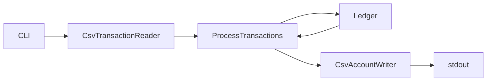

# Payments Engine

A CSV-driven toy payments engine that processes client transactions, maintains account balances, handles dispute lifecycles, and emits a final account snapshot.

## Goal

Build a command-line program that:

1. Reads a chronological stream of transactions from a CSV file
2. Updates per-client account balances (`available`, `held`, `total`, `locked`)
3. Handles deposits, withdrawals, disputes, resolves, and chargebacks
4. Writes the final account state to **stdout** as CSV

The engine models off-chain payment flows where funds can be credited, debited, held during disputes, released on resolution, or permanently removed on chargeback—with the account frozen afterward.

## What the Program Does

### CLI

```bash
cargo run -- transactions.csv > accounts.csv
```

- **Input:** path to a CSV file as the first and only argument
- **Output:** account snapshot written to **stdout**
- **Build:** `cargo build` / `cargo run`

### Input CSV

Columns: `type`, `client`, `tx`, `amount`


| Field    | Type / rules                                                 |
| -------- | ------------------------------------------------------------ |
| `type`   | `deposit`, `withdrawal`, `dispute`, `resolve`, `chargeback`  |
| `client` | `u16` client ID                                              |
| `tx`     | `u32` transaction ID (globally unique)                       |
| `amount` | decimal, up to 4 fractional digits (deposit/withdrawal only) |


- Rows are **chronological** — later rows occur after earlier ones
- Whitespace around fields and varying decimal precision (≤ 4 places) must be accepted
- `dispute`, `resolve`, and `chargeback` rows reference a `tx` only (no `amount`)

### Output CSV

Columns: `client`, `available`, `held`, `total`, `locked`


| Column      | Description                                                    |
| ----------- | -------------------------------------------------------------- |
| `available` | Funds usable for trading, staking, withdrawal (`total - held`) |
| `held`      | Funds held for dispute — running sum of currently-disputed deposit amounts (`total - available` at output time) |
| `total`     | `available + held`                                             |
| `locked`    | `true` if a chargeback occurred on the account                 |


Output formatting is flexible: spacing, integer vs decimal display, and row order do not matter. Values use **4 decimal places** of precision. `held` is tracked directly during processing; `total - available` is the output-time identity, not the source of truth.

### Processing Model

Transactions are processed **incrementally** (row-by-row streaming). The full input file is never loaded into memory. State is maintained in bounded in-memory maps keyed by client and transaction ID.

## Design Principles

- **Correctness over cleverness** — business rules live in the domain layer with explicit, testable transitions
- **Fixed-precision money** — never use `f64` for balances; use scaled integers (`i64` × 10⁴)
- **Explicit domain invariants** — enforce `available + held == total` after every state change
- **Streaming and bounded memory** — process one row at a time; avoid loading the entire CSV
- **Separation of concerns** — presentation, application, domain, and infrastructure are isolated layers with one-way dependencies
- **Fail silently on partner errors** — invalid dispute/resolve/chargeback rows are ignored, not fatal
- **Maintainability** — readable code and clear module boundaries matter more than micro-optimizations

## Requirements

### Account Model

- Each client has a single asset account identified by a `u16` ID
- Accounts are **auto-created** on first mention in a transaction
- Client IDs and transaction IDs are unique but not required to be sorted

### Transaction Semantics


| Type           | Effect on balances                                            | On failure / invalid                            |
| -------------- | ------------------------------------------------------------- | ----------------------------------------------- |
| **deposit**    | `available` ↑, `total` ↑ by `amount`                          | —                                               |
| **withdrawal** | `available` ↓, `total` ↓ by `amount`                          | **No-op** if `available < amount`               |
| **dispute**    | `available` ↓, `held` ↑ by disputed amount; `total` unchanged | **Ignore** if referenced `tx` does not exist or is not a deposit |
| **resolve**    | `held` ↓, `available` ↑ by released amount; `total` unchanged | **Ignore** if `tx` missing or not under dispute |
| **chargeback** | `held` ↓, `total` ↓ by disputed amount; `locked = true`       | **Ignore** if `tx` missing or not under dispute |


For dispute, resolve, and chargeback, the **amount comes from the original deposit** referenced by `tx`. Only deposit rows are stored in the transaction map for later dispute lookup.

### Dispute Lifecycle

```
Deposit → Dispute → Resolve   (funds released back to available)
                  → Chargeback (funds removed, account locked)
```

- A transaction can only be in one dispute state at a time: `None → Disputed → Resolved | ChargedBack`
- Repeated dispute/resolve/chargeback on the same `tx` in an invalid state is **ignored**
- The `client` on a dispute row must match the client on the original transaction; mismatches are **ignored**
- Only `deposit` transactions can be disputed — this matches the fraud scenario in the spec (reverse a fraudulent deposit after withdrawing proceeds), avoids negative `available`, and mirrors real chargeback semantics where the disputed credit is reversed

### Locked Accounts

- An account is locked when a chargeback occurs
- Post-lock behavior: all further rows for that client are **ignored**, including in-flight `resolve`/`chargeback` for transactions that were already under dispute when the lock occurred (documented assumption)

### Precision

- All amounts support up to **4 decimal places**
- Arithmetic uses fixed-point representation to avoid floating-point drift

### Error Handling

| Situation | Behavior |
| --------- | -------- |
| CLI usage errors (missing or extra arguments) | Print usage to **stderr**, exit code **2** |
| I/O errors opening or reading the input file | Message to **stderr**, exit code **1** |
| Output write errors (broken pipe on stdout) | Exit **0** on `EPIPE`; exit **1** on other write errors |
| Malformed CSV rows (bad header, unparseable amount, unknown `type`, missing required fields) | Silently skipped; processing continues |
| Partner errors (unknown `tx`, wrong lifecycle state, client mismatch, locked account) | Silently ignored — see [Assumptions](#assumptions) |

This policy is consistent with a streaming-server deployment: one bad row never tears down a session.

### Assumptions


| Topic                | Decision                                                                |
| -------------------- | ----------------------------------------------------------------------- |
| Withdrawal failure   | Silent no-op; balances unchanged                                        |
| Invalid partner rows | Silently ignored (unknown `tx`, wrong lifecycle state, client mismatch) |
| Locked account       | All subsequent rows for that client are rejected, including `resolve`/`chargeback` |
| Dispute target       | Only deposit transactions are disputable                                |
| Double dispute       | Second dispute on same `tx` is ignored                                  |


## High-Level Architecture




**Data flow:**

1. CLI parses `argv[1]` as the input file path
2. `CsvTransactionReader` streams parsed `Transaction` rows
3. `ProcessTransactions` applies each row to the domain `Ledger`
4. On EOF, `Ledger` produces account snapshots
5. `CsvAccountWriter` serializes snapshots to stdout

**Dependency rule:** `presentation → application → domain ← infrastructure`. The domain layer has no I/O or framework dependencies.

## Layered Module Structure

```
src/
  main.rs                          # thin entrypoint
  lib.rs                           # module root and public re-exports
  presentation/
    mod.rs
    cli.rs                         # argv parsing, file opening, exit codes
  application/
    mod.rs
    process_transactions.rs        # orchestration: read → apply → write
  domain/
    mod.rs
    transaction.rs                 # TransactionKind, Transaction
    account.rs                     # Account balances and locked flag
    ledger.rs                      # payments engine rules, dispute state, 
  infrastructure/
    mod.rs
    csv.rs                         # serde/csv row parsing + snapshot serialization
```

### Layer Responsibilities


| Layer              | Responsibility                                                                | Depends on                  |
| ------------------ | ----------------------------------------------------------------------------- | --------------------------- |
| **Presentation**   | CLI argument parsing, I/O wiring, error-to-exit-code mapping                  | Application, Infrastructure |
| **Application**    | Orchestrate streaming: read transaction → apply to ledger → write snapshot    | Domain                      |
| **Domain**         | All payment and dispute business rules, balance invariants, state transitions | Nothing external            |
| **Infrastructure** | CSV parsing/writing, serde adapters, whitespace-tolerant decimals             | Domain types                |


### Key Abstractions

**Domain:**

- `Amount` — fixed-point `i64` scaled ×10⁴ (kept as a simple alias/helper instead of a dedicated `Money` module because the problem only needs add/sub/compare while still avoiding floating-point rounding)
- `TransactionKind` — `Deposit`, `Withdrawal`, `Dispute`, `Resolve`, `Chargeback`
- `Account` — `available`, `held`, `locked`; invariant `total == available + held`
- `DisputeState` — `None | Disputed | Resolved | ChargedBack`
- `StoredTransaction` — internal ledger record containing `client`, `amount`, and `dispute_state`; only **deposit** rows are inserted into the tx map — `withdrawal`, `dispute`, `resolve`, and `chargeback` rows are not stored
- `Ledger` — `HashMap<u16, Account>` + `HashMap<u32, StoredTransaction>`; `apply(&Transaction)`

**Application:**

```rust
fn run<R: Read, W: Write>(input: R, output: W) -> Result<(), AppError>
```

**Infrastructure:** `csv.rs` owns the serde row types plus CSV parsing and snapshot writing helpers over standard `Read` / `Write`.

### Scalability Notes

- Transaction IDs are valid `u32` values — design for large datasets
- Streaming row-by-row keeps memory bounded regardless of file size
- `HashMap` lookups by client/tx are O(1); no full replay needed
- Standard `Read` / `Write` boundaries keep the orchestration testable without introducing extra adapter traits
- `Ledger` owns no global state — one engine instance per stream/session over generic `Read`/`Write` makes per-connection orchestration trivial
- Cross-stream horizontal scaling is sharding by `client`: ledgers are disjoint on client ID, so partitioning is mechanical and lock-free

## Testing Strategy


| Layer              | What to test                                                | Why                              |
| ------------------ | ----------------------------------------------------------- | -------------------------------- |
| **Domain unit**    | Balance transitions, dispute lifecycle, invariants          | Highest ROI; pure logic, no I/O  |
| **Application**    | `ProcessTransactions` with in-memory `Read` / `Write`       | Validates orchestration wiring   |
| **Infrastructure** | CSV whitespace, decimal formats, missing amount columns     | Catches serde/parsing edge cases |
| **Integration**    | `cargo run -- sample.csv` vs golden `expected_accounts.csv` | Matches automated scoring path   |


### Test Helpers

- `Ledger::from_transactions(&[Transaction])` for table-driven domain tests
- In-memory `&[u8]` / `Vec<u8>` buffers for application tests
- Fixture files in `tests/` (e.g. `sample_transactions.csv`, `expected_accounts.csv`)

### What We Verify

- Domain invariants hold after every `apply` call
- Invalid partner data is silently ignored (no panics, no balance changes)
- Output is deterministic when accounts are sorted by `client`
- 4-decimal precision is preserved through arithmetic

## Key Test Cases

### Deposits and Withdrawals

- [ ] Deposit increases `available` and `total` by the deposited amount
- [ ] Withdrawal with sufficient funds decreases `available` and `total`
- [ ] Withdrawal with insufficient funds is a no-op (all balances unchanged)
- [ ] Multiple deposits and withdrawals across clients produce correct final balances
- [ ] Client account is auto-created on first transaction

### Dispute Lifecycle

- [ ] Dispute on a valid deposit moves funds from `available` to `held`; `total` unchanged
- [ ] Dispute referencing a withdrawal `tx` is ignored
- [ ] Resolve on a disputed transaction moves funds from `held` back to `available`; `total` unchanged
- [ ] Chargeback on a disputed transaction decreases `held` and `total`; sets `locked = true`
- [ ] Full cycle: deposit → dispute → resolve restores original available balance
- [ ] Full cycle: deposit → dispute → chargeback removes funds and locks account

### Invalid / Edge Cases

- [ ] Dispute referencing unknown `tx` is ignored
- [ ] Resolve on a non-disputed `tx` is ignored
- [ ] Chargeback on a non-disputed `tx` is ignored
- [ ] Second dispute on an already-disputed `tx` is ignored
- [ ] Dispute with mismatched `client` vs original transaction is ignored
- [ ] Transactions on a locked account are ignored

### Invariants and Formatting

- [ ] `available + held == total` after every processed transaction
- [ ] CSV input with extra whitespace and varying decimal precision (`1.0` vs `1.0000`) parses correctly
- [ ] Output values maintain 4-decimal precision
- [ ] Integration test: sample input file produces expected golden output

## Dependencies


| Crate          | Purpose                                        |
| -------------- | ---------------------------------------------- |
| `csv`, `serde` | CSV parsing and serialization (infrastructure) |
| `thiserror`    | Error type definitions                         |


## Usage

```bash
# Build
cargo build

# Run against a transaction file
cargo run -- transactions.csv > accounts.csv

# Run tests
cargo test
```

